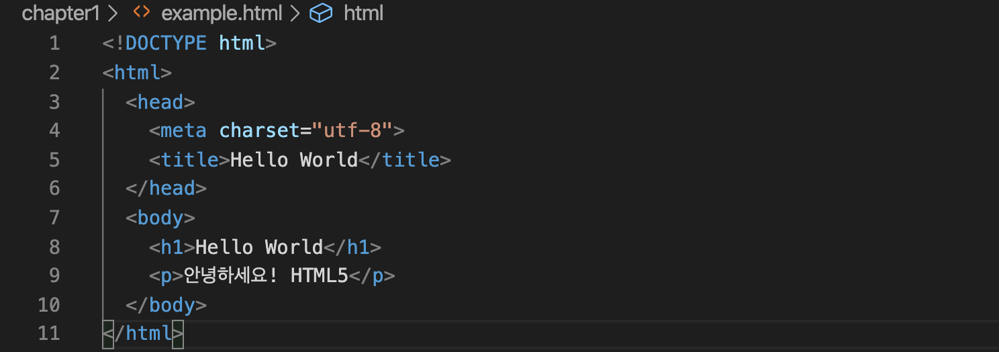
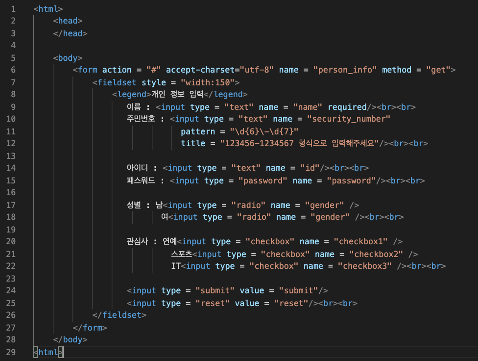
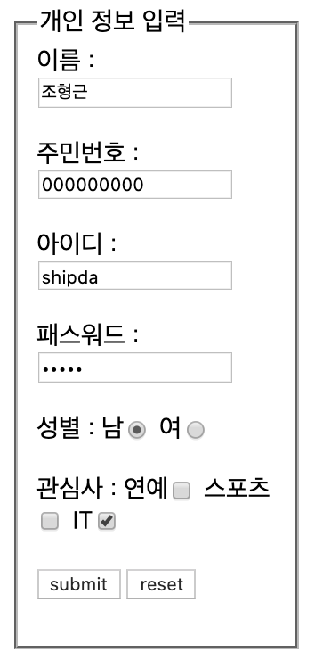

# HTML
웹페이지는 HTML, CSS, Javascript로 구성이 되며 이를 웹표준 구성요소 3가지라고 부른다.
이번 시간에는 그 중에서 웹페이지의 내용과 구조를 담당하는 HTML를 알아보려고 한다.

## HTML 기초
HTML은 웹페이지를 기술하기 위한 마크업 언어로 태그를 통해 정보를 구조화 한다.
이러한 HTML의 기본구조와 문법에 대하여 간단히 정리해봤다.

### HTML의 기본구조
HTML5 문서는 반드시 \<!DOCTYPE html>으로 시작하여 문서 형식을 HTML으로 지정한다.
실제적인 HTML document은 \<html>과 \</html> 사이에 작성한다.
\<head>와 \</head> 사이에는 document title, 외부 파일의 참조, 메타데이터의 설정 등이 위치하며 이 정보들은 브라우저에 표시되지 않는다,
웹브라우저에 출력되는 모든 요소는 \<body>와\</body> 사이에 위치한다.

### HTML의 기본 문법
- **요소**: HTML 요소는 시작 태그와 종료 태그 그리고 사이에 위치한 content로 구성된다.
요소는 요소 안에 다른 요소를 포함할 수 있고, 이때 부자관계가 성립된다.
이러한 부자관계로 정보를 구조화한다.

- **어트리뷰트** 어트리뷰트는 요소의 성질, 특징을 정의한다.
요소는 어트리뷰트를 가질 수 있고, 어트리뷰트는 요소에 이미지같은 추가적인 정보를 제공한다.

**출처**
https://poiemaweb.com/html5-syntax

## HTML Form

### HTML Form??
HTML폼은 사용자와 웹사이트 또는 어플리케이션이 서로 상호 작용하는 것 중 중요한 기술 중에 하나이다. 
폼은 사용자가 웹사이트에 데이터를 전송하는 것을 허용한다. 
전송된 데이터는 웹 서버가 처리하고, 결과에 따른 또 다른 웹페이지를 보여주게 된다.
이러한 Form에는 다양한 속성과 요소가 존재한다.

### Form 태그 속성
Form 태그 속성에는 name, action, method, target 등이 있는데 이 속성을 이용해 전송할 때 어디로 보내야 할지 그리고 어떤 방법으로 보낼지 정한다.
폼 태그의 속성은 다음과 같다.
- **action**: 폼을 전송할 서버 쪽 스크립트 파일을 지정한다.
- **name**: 폼을 식별하기 위한 이름을 지정한다.
- **accept-charset**: 폼 전송에 사용할 문자 인코딩을 지정한다.
- **target**: action에서 지정한 스크립트 파일을 현재 창이 아닌 다른 위치에 열도록 지정한다.
- **method**: 서버에 전송할 http 메소드를 정한다. (GET 또는 POST)

### Form을 구성하는 엘리먼트들
1. 폼 엘리먼트 그룹 \<field>, \<legend> 태그
\<field> 테그 하위에 \<legend> 태그를 사용하여 그룹화한 폼 엘리먼트의 이름을 지정할 수 있다.

2. \<input> 태그
\<input>태그는 사용자가 다양하게 폼 태그에 입력할 수 있는 공간을 만들어 준다.
다양한 속성들이 존재하는데 자주 쓰는 몇 가지만 정리해봤다.
* type: 태그 모양을 다양하게 변경할 수 있다. type에는 text, checkbox, submit, password 등이 있다.
* name: 태그 이름을 지정한다.
* readonly: 해당 태그 최대 글자 수를 지정한다.
* placeholder: 태그에 입력할 값에 대한 힌트를 준다.
* required: 해당 태그가 필수태그로 지정된다.

3. 목록태그 \<select>, \<optgroup>, \<option>
\<select>는 항목을 선택할 수 있는 태그이다 size 속성으로 한번에 표시할 항목 수를 정하고 multiple로 다중선택을 허용할 수 있다.
그리고 하위 태그로 \<optgroup> 태그와 \<option> 태그가 있다.
태그 안에서 목록들을 그룹화를 하려면 \<optgroup>을 사용하고, \<option> 태그는 목록을 나타내는 태그다.

4. 여러 줄 글상자 \<textarea>,
여러 줄을 입력받는 태그다.
row로 줄을, cols로 한 줄에 입력될 크기를 지정할 수 있다.

정리한 것 이외에도 다양한 엘리먼트들로 Form 태그의 모양을 만들 수가 있다.

5. 간단한 예

### Form 마무리
폼은 웹 페이지 안에 또 다른 페이지이며, 사용자와 대화를 할 수 있게 해준다.
폼을 구성하는 정보는 많이 있고, 상황에 맞게 지정하면 큰 어려움 없이 만들 수 있다.
form을 만드는 간단한 예제도 많기 때문에 쉽게 따라해보면서 익힐 수 있다.
[MDN form 만들어보기 예제](https://developer.mozilla.org/ko/docs/Learn/HTML/Forms/Your_first_HTML_form)

**출저**
http://www.nextree.co.kr/p8428/

## HTML SEO기초

### SEO??
SEO는 Search Engine Optimization의 줄임말로 번역하자면 검색엔진 최적화라고 한다.
검색엔진 최적화란 검색엔진 결과 페이지에서 자신의 웹사이트 혹은 웹페이지의 순위와 노출도를 높여 트래픽의 양과 질을 높이는 최적화 작업이다.
쉽게 비유하자면 나의 매장(웹사이트)을 좋은 상권(검색엔진 검색결과 첫페이지)으로 이전시키는 작업인 것이다.

### 검색엔진최적화 방법
검색엔진최적화 방법은 검색엔진이 좋아하는 웹사이트의 조건을 갖추는 것이다.
대표적인 검색엔진 google의 검색결과 순위 요소는 200여 가지가 육박한다고 한다.
그러나 모두 동일한 중요도를 가지는 것은 아니라 가장 중요한 최적화 요소를 파악하고 적용하면 된다.
중요한 최적화 요소 몇 가지를 간단하게 정리해봤다.

1. 보안 프로토콜 (HTTPS)
구글은 2014년 HTPPS 보안 프로토콜을 사용하는 웹사이트에 더 높은 점수를 부여할 것이라고 발표했다.
그 뒤로 많은 사이트들이 보안 프로토콜을 사용하게 되었고, 검색엔진최적화를 위해서는 기본적으로 HTTPS를 적용해야 한다.

2. Robots.txt $ Sitemap.xml
robots.txt는 웹사이트에 대한 검색엔진 로봇들의 접근을 조절, 제어하고 로봇들에게 웹사이트의 사이트맵이 어디 있는지 알려주는 역할을 한다.
robots.txt는 html이 아닌 일반 텍스트파일로 작성하고 사이트의 루트 디렉토리에 위치해야 한다.
sitemap.xml은 웹사이트 내 모든 페이지의 목록을 나열한 파일이다.
사이트맵을 제출하면 쉽게 발견되지 않는 웹페이지도 문제없이 크롤링되고 색인될 수 있게 해준다.
그렇기 때문에 구성이 복잡하고 깊이가 깊은 계층형 구조를 가진 사이트는 필수적으로 사이트맵을 갖고 있어야 한다.
[robots.txt와 sitemap.xml 파일 설정하는 법](https://www.twinword.co.kr/blog/basic-technical-seo/)

3. 타이틀 & 메타디스크립션 태그
타이틀 태그는 웹페지의 제목에 해당되고, 메타디스크립션은 중심 내용을 요약하여 설명해주는 역할을 한다.
웹 사이트의 웹페이지들은 각각 다른 내용을 포함하고 있기 때문에 웹페이지별로 독특한 타이틀 태그와 메타디스크립션 태그를 갖고 있어야 한다. 

4. 소셜 검색엔진최적화 메타태그
구글은 웹사이트가 구글플러스에서 얼마나 공유되었는지, 페이스북으로부터 들어오는 트래픽이 어느 정도인지와 같은 지표를 통해 해당 웹사이트의 품질을 시시각각 평가하고 있다.
그렇기 때문에 웹사이트의 콘텐츠를 소셜미디어에서 공유하고 퍼플리싱하는 작업도 큰 부분을 차지한다.
오픈그래프 태그(Open Graph)와 트위터 카드 태그를 설정해 소셜미디어에서 해당 URL을 공유할 때 보여지는 정보를 컨트롤 할 수 있다.

5. 이미지 태그 및 최적화
구글의 전체 검색 중 1/3을 차지하는 이미지 검색 또한 아주 중요한 요소이다.
이미지와 관련된 HTML 태그 중 가장 중요한 것은 이미지 Alt 태그다.
Alt 태그는 이미지에 대한 설명을 해주는 HTML이다.
Alt 태그가 잘 설정되어 있는 이미지는 구글 이미지 검색에서 높은 검색순위를 가질 수 있고, 스크린리더를 사용하는 사람들이 웹페이지를 이해하는데 도움이 된다.

6. 모바일 최적화
2015년부터 모바일 검색이 데스크톱 검색 수를 넘어섰고 구글은 모바일 퍼스트 전략을 추구하게 되었다.
그렇기 때문에 모바일 최적화는 매우 중요한 구글 SEO 랭킹 요소가 되었고, 많은 글로벌 회사들이 모바일 친화적인 웹사이트를 구축해 운영 중이다.
이러한 모바일 최적화는 반응형 웹사이트를 만드는 것이 가장 좋은 방법이다.
반응형 웹사이트는 하나의 페이지 소스로 다양한 기기의 페이지, 해상도, 레이아웃에 맞는 화면을 유동적으로 보여주는 사이트를 의미한다.

7. 대표 주소 설정
검색엔진최적화의 핵심은 내 도메인, URL의 최적화 점수를 높이는 것이다.
만약 하나의 페이지를 접속하는 방법이 여러 가지가 있다면 대표 주소를 정하고 나머지는 리다이렉트를 설정하는 것이 좋다.

8. 키워드 및 콘텐츠 최적화
키워드는 구글 뿐 아니라 네이버 검색엔진 최적화에서도 매우 중요한 부분을 차지한다.
구글은 독특하고 정보가 풍부하게 담긴 콘텐츠를 좋아한다고 한다.
그래서 다른 사이트에 있는 글을 그대로 복사하거나, 뜨는 검색어 순위를 보고 글을 두서없이 작성해 퍼블리싱하면 구글에 의해 제재를 받을 수도 있다.
우연히 통과해도 해당 분야에 대한 주제 연관성이 낮아 상위 랭킹을 차지할 가능성이 매우 낮다.
그렇기 때문에 콘텐츠를 기획할 때, 웹사이트가 어떤 분야, 주제와 관련이 있어햐 할지 생각하고, 그 주제와 관련된 키워드를 찾은 후 콘텐츠를 작성해야 한다.

### SSR과 CSR
검색엔진최적화와 CSR, SSR은 관계가 없어보이나 사실은 밀접한 관계를 가지고 있다.
그래서 간단하게 CSR과 SSR을 알아보고 두 방식과 SEO의 관계를 정리해봤다.

- **SSR**: Server Side Rendering의 약어로 단어 그대로 서버에서 렌더링을 작업한다.
예전부터 존재하던 방식으로 웹페이지에 접근할 때, 서버에 페이지 요청을 하게된다.
서버에서는 html, view와 같은 리소스들이 어떻게 보여질지 해석하고 렌더링해서 사용자에게 반환한다.
그래서 처음 로딩 시 빠르게 작동하지만 요청을 할 때마다 새로고침이 생기는 단점이 있고, 서버에 부담도 크다.

- **CSR**: Client Side Renering의 약어로 최초에 1번 서버에서 전체 페이지를 로딩하여 보여주고 이후에는 사용자의 요청이 올때마다,
리소스를 서버에서 제공한 후 클라이언트가 해석하고 렌더링을 하는 방식이다.
그래서 처음 로딩 시 HTMl를 다운받은 다음 JS파일이나 각종 리소스를 다운받아 브라우져에서 렌더링하여 보여주기 때문에 초기 view를 보는 시간이 상대적으로 길다.
그러나 요청을 할 때마다 새로고침을 하지 않아도 되고 서버의 부담이 적다.

- **SEO와의 관계**: CSR방식으로 이루어진 사이트는 view를 생성하는데 자바스크립트가 필요하다.
그래서 그 전까지 HTML의 내용은 비어있기 때문에 웹 크롤러들이 내용을 알 수 없고, 제대로 된 데이터를 수집할 수 없다.
반대로 SSR방식은 view를 먼저 그리기 때문에 상대적으로 웹 크롤러의 데이터 수집을 많이 할 수 있어 SEO의 유리하다.
그래서 SEO를 위해서는 CSR보다는 SSR로 개발하는 것이 훨씬 유리하다.
그러나 SSR의 개발방식이 가지는 단점도 존재하기 때문에 개발하는 서비스의 목적에 따라서 선택할 필요가 있다.
최근에는 두가지의 방식을 융합하여 개발하는 방식을 이용하는 경우도 있다고 한다.

### SEO 마무리
지금까지 간단하게 SEO의 설명과 방법을 정리해봤다.
검색이 생활화되고, 모든 회사들이 각자의 웹사이트와 서비스를 가지고 있는 시대에서 좋은 자리를 선점할 수 있는 SEO는 아주 중요한 요소라고 생각한다.
그리고 이런 SEO를 하기 위해서는 아주 다양한 기술과 전략적인 작업이 필요하다.
또한 검색엔진의 알고리즘과 사용자를 잘 이해해야 할 것이다.
그렇기 때문에 단순히 개발의 영역이 아니라 마케팅의 영역이라고도 할 수 있을 것 같다.
아래에는 대표적인 검색사이트 구글과 네이버에서 제공하는 SEO 가이드이다.
[네이버 SEO 가이드](https://searchadvisor.naver.com/guide/seo-basic-intro)
[구글 SEO 가이드](https://support.google.com/webmasters/answer/7451184?hl=ko)

**출저**
https://www.twinword.co.kr/blog/search-engine-optimization-guide/
